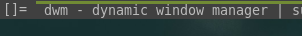

dash_above_activeWindow
=============

Description
-----------
Create a line above active window with schemeSel color , while setting
the background of text to the schemeNorm

Config variables are avaliable to edit the width of bar dash , its y-position
as well as text y-position in the bar.

> [!WARNING]
> If you are using [bidi patch](https://dwm.suckless.org/patches/bidi/)
> Make sure to move apply_fribidi just above drw_text.

Download
--------
* [dwm-dash_above_activeWindow-20240604-061e9fe.diff](dwm-dash_above_activeWindow-20240604-061e9fe.diff)

Author
------
* [Alhussien Ahmed](https://github.com/donRehan)
